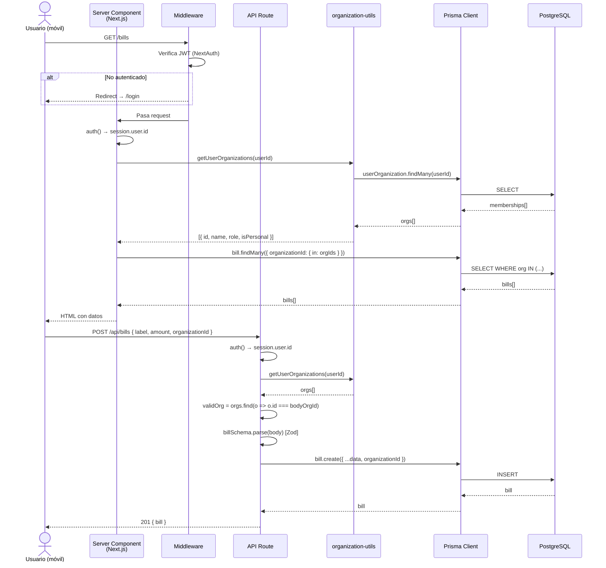

# ARCHITECTURE.md — Tortuguita v2

> Mapa Maestro del proyecto. Última actualización: 2026-05-05.
> Leer antes de tocar cualquier cosa. Todo lo que está aquí surge del código real, no de suposiciones.

---

## 1. Overview del Stack

| Tecnología | Versión | Rol |
|---|---|---|
| **Next.js** | 16.1.2 (App Router) | Framework full-stack. Server Components + API Routes. |
| **React** | 19.2.3 | UI. Se usa `use client` solo donde hay estado o eventos. |
| **TypeScript** | ^5 | Tipado estricto en todo el proyecto. |
| **Prisma** | ^6.19.2 | ORM. Schema en `prisma/schema.prisma`, client singleton en `lib/prisma.ts`. |
| **NextAuth v5** | ^5.0.0-beta.30 | Autenticación JWT. Solo `CredentialsProvider` (email + contraseña). |
| **Tailwind CSS** | ^4 | Estilos. PostCSS v4. Variables CSS propias para colores y tipografías. |
| **Zod** | ^4.3.5 | Validación de schemas en API routes (`lib/validations/`). |
| **bcryptjs** | ^3.0.3 | Hash de contraseñas en signup/reset/profile. |
| **date-fns** | ^4.1.0 | Manipulación de fechas. Locale `es` en toda la UI. |
| **Radix UI** | varios | Componentes headless: Dialog, DropdownMenu, Select, Switch, etc. |
| **Lucide React** | ^0.562.0 | Sistema de íconos. `strokeWidth` varía entre activo (2.2) e inactivo (1.8). |
| **Anthropic SDK** | ^0.71.2 | Chat IA con Claude. Streaming via `/api/ai/chat`. |
| **Resend** | ^6.8.0 | Envío de emails (recuperación de contraseña). |
| **next-themes** | ^0.4.6 | Modo claro/oscuro con CSS variables. |
| **next-pwa** | ^5.6.0 | PWA: service worker, manifest, instalable en móvil. |
| **SWR** | ^2.3.8 | Data fetching con caché en cliente (usado en partes selectivas). |
| **ECharts** | ^6.0.0 | Gráficos del dashboard (`echarts-for-react`). |

---

## 2. Mapa de Directorios

```
tortuguita-v2/
│
├── app/                          # Next.js App Router
│   ├── layout.tsx                # Root: providers globales (Session, Theme, Language, SpacesProvider), fuentes
│   ├── globals.css               # Variables CSS (colores, radius), imports de Tailwind v4
│   │
│   ├── (auth)/                   # Rutas públicas — sin sesión requerida
│   │   ├── layout.tsx            # Fondo gradiente fijo, blob decorativos, contenedor centrado h-dvh scrollable
│   │   ├── login/                # Formulario login (email + password)
│   │   ├── signup/               # Registro con nombre, email, password y opción de espacio personal/compartido
│   │   ├── forgot-password/      # Solicitar reset de contraseña (envía email via Resend)
│   │   └── reset-password/       # Formulario para token de reset
│   │
│   ├── (dashboard)/              # Rutas protegidas — requieren sesión (middleware)
│   │   ├── layout.tsx            # Shell principal: SimpleHeader sticky + <main> flex-1 overflow-y-auto + BottomNav
│   │   ├── dashboard/            # Página de inicio: resumen del mes, gastos por categoría, gráficos
│   │   ├── bills/                # Lista de gastos + detalle individual + formulario edición
│   │   ├── bills/new/            # Formulario de creación de gasto (QuickBillForm)
│   │   ├── cuotas/               # Vista de cuotas activas (gastos en installments)
│   │   ├── cuotas/new/           # Crear cuota (mismo QuickBillForm con defaultInstallments=3)
│   │   ├── cards/                # Administrar tarjetas de crédito (BillTypes con isCreditCard=true)
│   │   ├── categories/           # Administrar categorías de gasto (BillTypes con isCreditCard=false)
│   │   ├── incomes/              # Lista e ingreso de ingresos
│   │   ├── income-types/         # Tipos de ingreso por espacio
│   │   ├── ai/                   # Chat con Claude (conversaciones persistentes por org)
│   │   └── settings/             # Perfil, espacios, miembros, ingresos del mes
│   │
│   └── api/                      # API Routes (ver sección 5 para el mapa completo)
│
├── components/
│   ├── layout/
│   │   ├── simple-header.tsx     # Header sticky: logo + selector de espacios (se oculta en forms de gastos)
│   │   └── bottom-nav.tsx        # Nav flotante pill glass morphism: Inicio / Gastos / Cuotas / Perfil
│   │
│   ├── ui/                       # Primitivas reutilizables basadas en Radix (button, card, dialog, input, badge...)
│   │                             # También card-network.tsx (logos de tarjetas) y month-picker.tsx
│   │
│   ├── bills/                    # Todo lo relacionado con gastos
│   │   ├── quick-bill-form.tsx   # Formulario principal crear/editar gasto (modo create/edit, space selector, splits)
│   │   ├── bill-detail.tsx       # Vista detalle de un gasto con botones editar/eliminar
│   │   ├── bills-content.tsx     # Lista de gastos con filtros
│   │   ├── bills-view.tsx        # Wrapper con tabs CC / regulares
│   │   └── delete-bill-button.tsx# Botón eliminar con confirmación (variantes: asMenuItem, fullWidth)
│   │
│   ├── categories/               # Formulario y lista de categorías (CategoryFormV2)
│   ├── dashboard/
│   │   └── home-dashboard.tsx    # ⚠️ DISEÑO APROBADO — no modificar sin instrucción explícita
│   ├── settings/
│   │   ├── settings-hub.tsx      # Hub principal de settings: espacios, gestión de miembros, perfil, tema
│   │   ├── profile-content.tsx   # Formulario perfil + cambio contraseña + eliminar cuenta
│   │   └── income-settings.tsx   # Configuración de ingresos del mes por espacio
│   │
│   └── providers/
│       └── language-provider.tsx # Proveedor de idioma (hook useTranslations, soporte es/en)
│
├── lib/
│   ├── auth.ts                   # Config NextAuth: CredentialsProvider, callbacks JWT/session
│   ├── prisma.ts                 # Singleton del Prisma Client (evita hot-reload proliferation)
│   ├── organization-utils.ts     # Funciones de acceso multi-org (ver sección 4)
│   ├── budget-date.ts            # Lógica de fechas de presupuesto para tarjetas de crédito (ver sección 4)
│   ├── spaces-context.tsx        # Context + hook useSpaces: activeSpaceIds, toggleSpace, isHydrated
│   ├── utils.ts                  # cn() para merge de clases Tailwind (clsx + tailwind-merge)
│   ├── rate-limit.ts             # Rate limiting por IP para rutas de auth
│   ├── haptics.ts                # Wrapper de Web Haptics API (feedback táctil móvil)
│   ├── default-categories.ts     # Templates de categorías/tipos de ingreso por defecto
│   ├── validations/              # Schemas Zod (bill, bill-type, income, income-type)
│   ├── i18n/                     # Traducciones es/en y helpers
│   └── ai/                       # Definición de tools de Claude + handlers + safety
│
└── prisma/
    ├── schema.prisma             # Fuente de verdad de la base de datos (PostgreSQL)
    └── seed.ts                   # Datos de prueba para desarrollo
```

---

## 3. Diagrama de Flujo

### Flujo general de una request autenticada



### Arquitectura Multi-Espacio (Spaces)

```mermaid
graph TD
    A[Usuario] -->|cookie activeSpaceIds| B[useSpaces Context]
    B -->|Set ids activos| C[SimpleHeader — Space Selector]
    B -->|Set ids activos| D[QuickBillForm — filtro categorías/miembros]

    A -->|JWT token| E[NextAuth Session]
    E -->|userId| F[API Routes]
    F -->|getUserOrganizations| G[(PostgreSQL<br/>UserOrganization)]
    G -->|orgIds[]| H[WHERE organizationId IN orgIds]
    H --> I[(Bills / Incomes / BillTypes)]

    style G fill:#f4acb7,color:#2c1f24
    style I fill:#d8e2dc,color:#2c1f24
```

---

## 4. Entidades Clave (Prisma Schema)

### Relaciones principales

```
User ──< UserOrganization >── Organization
                                   │
                    ┌──────────────┼──────────────┐
                    │              │               │
                 BillType        Bill          Income
                    │              │               │
                    │         BillAssignment  IncomeAssignment
                    │         (userId, %)     (userId, %)
                    │
                 (isCreditCard=true → Tarjeta con período de facturación)
                 (isCreditCard=false → Categoría de gasto regular)
```

### Modelos y campos clave

| Modelo | Campos importantes | Relaciones |
|---|---|---|
| **User** | id, name, email (unique), password (bcrypt), currentOrganizationId (legacy) | → UserOrganization, Bill, Income, Conversation |
| **Organization** | id, name, joinCode (unique, 6 chars), isPersonal | ← UserOrganization, → BillType, Bill, Income, Conversation |
| **UserOrganization** | userId, organizationId (unique pair), role (`owner`\|`member`), joinedAt | → User, → Organization |
| **BillType** | name, color, icon, **isCreditCard**, currentClosingDate, currentDueDate, nextClosingDate, nextDueDate | → Organization; ← Bill (billTypeId o categoryId) |
| **Bill** | label, amount (Decimal 10,2), paymentDate, **budgetDate**, dueDate, billTypeId, categoryId?, **totalInstallments**, **currentInstallment**, **installmentGroupId** | → BillType, → Organization, → User; ← BillAssignment |
| **BillAssignment** | billId, userId, percentage (Decimal 5,2) — unique (billId, userId) | → Bill, → User |
| **Income** | label, amount, incomeDate, incomeTypeId, organizationId, userId | → IncomeType, → Organization, → User; ← IncomeAssignment |
| **IncomeAssignment** | incomeId, userId, percentage — unique (incomeId, userId) | → Income, → User |
| **Conversation** | title, userId, organizationId | → User, → Organization; ← Message |
| **Message** | conversationId, role, content (Text), toolCalls (Json) | → Conversation |

### Conceptos de negocio que no son obvios

**`budgetDate` vs `paymentDate`**
Un gasto de tarjeta de crédito puede pagarse el 3 de junio pero impactar en el presupuesto de mayo (si el cierre de la tarjeta fue el 25/5). `paymentDate` = cuándo se hizo la compra. `budgetDate` = a qué mes presupuestario impacta. La lógica está en `lib/budget-date.ts`.

**Cuotas (installments)**
Un gasto en 3 cuotas genera 3 filas `Bill` independientes con el mismo `installmentGroupId`, distintos `currentInstallment` (1, 2, 3) y `paymentDate` con offset mensual. El monto en cada fila es `totalAmount / totalInstallments`.

**`BillType` como dual: categoría y tarjeta**
El mismo modelo sirve para dos propósitos según `isCreditCard`:
- `false` → categoría de gasto (Supermercado, Restaurante, etc.)
- `true` → tarjeta de crédito con período de facturación (Visa, Mastercard, etc.)

---

## 5. Mapa de API Routes

| Ruta | Métodos | Descripción |
|---|---|---|
| `/api/auth/[...nextauth]` | GET, POST | Handler de NextAuth (login, session, CSRF) |
| `/api/auth/signup` | POST | Registro: crea User + Organization personal |
| `/api/auth/forgot-password` | POST | Genera token y envía email de reset (Resend) |
| `/api/auth/reset-password` | POST | Valida token y actualiza contraseña |
| `/api/bills` | GET, POST | Listar / crear gastos (scoped a orgs del usuario) |
| `/api/bills/[id]` | GET, PATCH, DELETE | Detalle / editar / eliminar gasto |
| `/api/bill-types` | GET, POST | Listar / crear categorías o tarjetas |
| `/api/bill-types/[id]` | GET, PUT, DELETE | Detalle / editar / eliminar categoría |
| `/api/bill-types/[id]/billing-period` | PATCH | Actualizar período de facturación de una tarjeta CC |
| `/api/incomes` | GET, POST | Listar / crear ingresos |
| `/api/incomes/[id]` | GET, PATCH, DELETE | Detalle / editar / eliminar ingreso |
| `/api/income-types` | GET, POST | Listar / crear tipos de ingreso |
| `/api/income-types/[id]` | GET, PATCH, DELETE | Detalle / editar / eliminar tipo de ingreso |
| `/api/organizations` | GET, POST | Listar espacios del usuario / crear espacio |
| `/api/organizations/[id]` | GET, PUT, DELETE | Detalle / renombrar / eliminar espacio |
| `/api/organizations/[id]/members` | GET, DELETE | Listar miembros / remover miembro (owner only) |
| `/api/organizations/[id]/leave` | POST | Salir de un espacio (non-owner only) |
| `/api/organizations/[id]/join-code` | PUT | Regenerar código de invitación |
| `/api/organizations/join` | POST | Unirse a espacio con código |
| `/api/users/profile` | PATCH, DELETE | Actualizar perfil / eliminar cuenta |
| `/api/users/switch-organization` | POST | Cambiar org activa (legacy, mayormente reemplazado) |
| `/api/settings/incomes` | GET, POST | Ingresos del mes por espacio |
| `/api/ai/chat` | POST | Enviar mensaje a Claude (streaming SSE) |
| `/api/ai/conversations` | GET, POST | Listar / crear conversaciones IA |
| `/api/ai/conversations/[id]` | GET, DELETE | Detalle / eliminar conversación |

---

## 6. Convenciones del Proyecto

### Autenticación y sesión

```ts
// Siempre al inicio de un API route
const session = await auth()
if (!session?.user?.id) return NextResponse.json({ error: "Unauthorized" }, { status: 401 })
```

### Scoping multi-org (patrón obligatorio en todos los GETs)

```ts
// NUNCA usar currentOrganizationId del JWT para filtrar listas
const orgIds = await getUserOrganizations(session.user.id).then(orgs => orgs.map(o => o.id))
const bills = await prisma.bill.findMany({
  where: { organizationId: { in: orgIds } }
})
```

### Validación con Zod

```ts
// Schema en lib/validations/
// Uso en POST/PATCH:
const { organizationId: bodyOrgId, ...rest } = body
const data = billSchema.parse(rest)  // Lanza ZodError si inválido

// Catch en el handler:
} catch (error) {
  if (error instanceof z.ZodError)
    return NextResponse.json({ error: error.issues[0].message }, { status: 400 })
}
```

### `organizationId` siempre viene del body, nunca del token

El token JWT puede tener `currentOrganizationId` (campo legacy), pero **no se usa para autorizar escrituras**. El body debe incluir `organizationId` y se valida contra las orgs del usuario:

```ts
const validOrg = bodyOrgId
  ? userOrgs.find(o => o.id === bodyOrgId)
  : userOrgs[0]
if (!validOrg) return NextResponse.json({ error: "Invalid space" }, { status: 403 })
```

### Server vs Client Components

- **Server por defecto**: pages en `app/(dashboard)/*/page.tsx` son Server Components.
- **Client cuando hay**: estado (`useState`), efectos (`useEffect`), eventos del browser, hooks de Next.js (`useRouter`, `usePathname`).
- Los forms (`quick-bill-form.tsx`, `profile-content.tsx`, etc.) son siempre `"use client"`.

### Patrón `returnTo` (preservar contexto de navegación)

Cuando un flujo secundario interrumpe otro (ej: crear categoría desde el form de gastos):

```ts
// En el form:
router.push(`/categories/new?spaceId=${selectedOrgId}&returnTo=${encodeURIComponent("/bills/new")}`)

// En la page de destino:
const { returnTo } = await searchParams
// En el component:
const dest = returnTo || `/categories?spaceId=${organizationId}`
router.push(dest) // Vuelve al origen tras guardar
```

### Layout y scroll en móvil

```
html, body → overflow: hidden (definido en globals.css — el app es un shell fijo)
(auth) layout → h-dvh overflow-y-auto (scroll dentro del contenedor)
(dashboard) layout → flex col h-dvh
  └── <main> → flex-1 overflow-y-auto overscroll-y-contain (scroll del contenido)
```

El `BottomNav` es `position: fixed` con `safe-area-inset-bottom` para iOS.

### Selector de espacios en el header

El `SimpleHeader` muestra el selector de espacios **solo** cuando:
1. El usuario tiene más de 1 espacio (`spaces.length > 1`)
2. El contexto está hidratado (`isHydrated`)
3. No está en una página de formulario de gastos (tiene su propio selector):

```ts
const HIDE_SELECTOR_PATHS = ["/bills/new", "/cuotas/new"]
function hideSelector(pathname: string) {
  return HIDE_SELECTOR_PATHS.some(p => pathname === p) ||
    /^\/bills\/[^/]+\/edit$/.test(pathname)
}
```

### Paleta de colores (constantes en código)

```ts
const MAUVE      = "#9D8189"   // textos secundarios, íconos activos, estados seleccionados
const MAUVE_DARK = "#4A3540"   // textos sobre fondo claro
const SAGE       = "#D8E2DC"   // gradiente hero inicio
const PEACH      = "#FFE5D9"   // gradiente hero medio
const PINK       = "#FFCAD4"   // gradiente hero fin
const ROSE       = "#F4ACB7"   // orbs decorativos, acentos
```

### Fuente serif para montos

```tsx
<span style={{ fontFamily: "var(--font-fraunces, serif)" }}>
  {Intl.NumberFormat("es-AR", { style: "currency", currency: "ARS" }).format(amount)}
</span>
```

### Glassmorphism (patrón visual recurrente)

```tsx
style={{
  background: "rgba(255,255,255,0.75)",
  backdropFilter: "blur(20px)",
  WebkitBackdropFilter: "blur(20px)",
  border: "1px solid rgba(255,255,255,0.8)",
  boxShadow: "0 8px 32px rgba(157,129,137,0.15)",
}}
```

También existe la clase CSS `.glass` definida en `globals.css` que aplica este patrón.

### Radix UI — regla crítica

**No anidar `<Dialog>` dentro de `<DropdownMenu>`** — Radix no lo soporta y produce comportamiento inesperado. Patrón correcto:

```tsx
// ✅ Correcto
const [itemToDelete, setItemToDelete] = useState<Item | null>(null)
// ...
{items.map(item => (
  <DropdownMenu>
    <DropdownMenuItem onClick={() => setItemToDelete(item)}>Eliminar</DropdownMenuItem>
  </DropdownMenu>
))}
<Dialog open={!!itemToDelete} onOpenChange={() => setItemToDelete(null)}>
  {/* confirmación */}
</Dialog>
```

---

## 7. Flujo de Datos: Creación de un Gasto con Cuotas

Ejemplo concreto para entender cómo se conectan las capas:

```
Usuario llena QuickBillForm
  └── selecciona espacio (selectedOrgId)
  └── elige tarjeta CC (cardId → billTypeId)
  └── ingresa monto $900, 3 cuotas
  └── click Guardar

POST /api/bills {
  label, amount: 900, billTypeId, paymentDate,
  totalInstallments: 3, organizationId, assignments: [...]
}

API route:
  1. Valida sesión
  2. getUserOrganizations → confirma que organizationId pertenece al user
  3. billSchema.parse(body) → valida tipos y rangos
  4. Busca BillType → obtiene billingPeriod (fechas de cierre/vencimiento CC)
  5. loop i=1..3:
     - paymentDate = paymentDate + (i-1) meses
     - budgetDate = calculateBudgetDate(paymentDate, isCreditCard, billingPeriod)
     - amount = 900 / 3 = 300
     - prisma.bill.create({ ..., installmentGroupId: uuid, currentInstallment: i })
  6. Promise.all(billPromises) → 3 rows en DB

Response: [bill1, bill2, bill3] con status 201
```

---

## Manejo de errores

### Principio general

Todos los mensajes visibles al usuario están **en español**. No se expone ningún mensaje de Prisma, Zod ni texto en inglés al frontend.

### Patrón en API routes

Cada ruta sigue este orden:

1. Autenticación: `if (!session?.user?.id) return { error: "Unauthorized" }` — este error no llega a usuarios normales porque el middleware protege las rutas.
2. Validación de permisos: si el recurso no pertenece al usuario → `{ error: "Gasto no encontrado" }` (404) o `{ error: "No tenés permisos…" }` (403).
3. Validación de datos: Zod lanza `ZodError` → se captura y se devuelve `{ error: msg }` (400). Mensajes de Zod en inglés se traducen antes de devolver al cliente.
4. Errores de DB: `try/catch` envuelve toda la lógica → `{ error: "Error al … Intentá de nuevo." }` (500).

### Mensajes específicos por ruta

| Ruta | Error | Código | Mensaje |
|---|---|---|---|
| `POST /api/bills` | Categoría inválida | 400 | "La categoría seleccionada no es válida" |
| `POST /api/bills` | Miembros inválidos | 400 | "Uno o más miembros asignados no pertenecen a este espacio" |
| `GET/PATCH/DELETE /api/bills/[id]` | No encontrado | 404 | "Gasto no encontrado" |
| `GET/PATCH/DELETE /api/bill-types/[id]` | No encontrado | 404 | "Categoría no encontrada" |
| `DELETE /api/bill-types/[id]` | Tiene gastos asociados | 409 | `{ error: "has_bills", count: N }` — el cliente muestra diálogo de confirmación |
| `DELETE /api/organizations/[id]/members` | No es miembro | 404 | "El miembro no pertenece a este espacio" |
| `DELETE /api/organizations/[id]/members` | Quererse remover a uno mismo | 400 | "No podés removerte a vos mismo. Eliminá el espacio." |
| `PATCH /api/users/profile` | Contraseña actual incorrecta | 400 | "Contraseña actual incorrecta" |
| `POST /api/resumen/parse` | JSON inválido de Claude | 422 | "No se pudo interpretar el resumen. Verificá que el PDF sea un resumen de tarjeta de crédito." |

### Errores de red (frontend)

En todos los `catch` de `fetch()`, se distingue `TypeError` (sin conexión) del resto:

```ts
} catch (err) {
  if (err instanceof TypeError && err.message.includes("fetch")) {
    setError("Error de conexión. Revisá tu conexión e intentá de nuevo.")
  } else {
    setError(err instanceof Error ? err.message : "Error inesperado. Intentá de nuevo.")
  }
}
```

### Patrón de confirmación en dos pasos (delete)

Las acciones destructivas usan un estado booleano `deleteConfirm` o `leaveConfirm`:

1. Primer click → `setDeleteConfirm(true)` → muestra mensaje de advertencia + botones "Confirmar" / "Cancelar".
2. Segundo click → llama a la API → en error, muestra el mensaje en el mismo diálogo.

Implementado en: `DeleteCategoryButton`, `BillDetail` (dialog), `SettingsHub` (eliminar/salir espacio), `ProfileContent` (eliminar cuenta).

### Estados vacíos (empty states)

Todas las vistas con listas muestran un estado vacío descriptivo en lugar de una lista vacía:

| Vista | Mensaje | CTA |
|---|---|---|
| `/bills` — sin gastos en el mes | "Sin gastos este mes · ¡La tortuguita descansa!" | Botón "Agregar gasto" |
| `/cuotas` — sin cuotas | "Sin cuotas en [mes] · ¡La tortuguita descansa!" | — |
| `/categories` — sin categorías | "Sin categorías todavía" | Botón "Agregar" |
| `/cards` — sin tarjetas | "Sin tarjetas todavía" | Botón "Agregar" |
| `QuickBillForm` — sin categorías en el espacio | "No hay categorías en este espacio" | Botón "Crear una" → `/categories/new` |
| `QuickBillForm` — crédito sin tarjetas | Aviso amarillo con link a `/cards` | — |

### Estados deshabilitados

Los botones "Guardar" están deshabilitados mientras faltan campos requeridos, y se muestra un hint textual debajo explicando qué falta:

- `QuickBillForm`: hints dinámicos como "Ingresá la descripción y el monto para guardar", "Seleccioná una tarjeta", etc.
- `ResumenImporter`: "Seleccioná una tarjeta y subí el PDF para continuar".
- `CategoryFormV2`: botón deshabilitado hasta que el nombre no esté vacío (sin hint adicional por lo obvio del campo).

---

*Este archivo describe el estado del código tal como existe. Si se agrega una feature importante, actualizarlo.*
